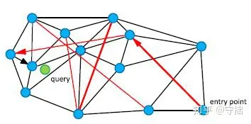
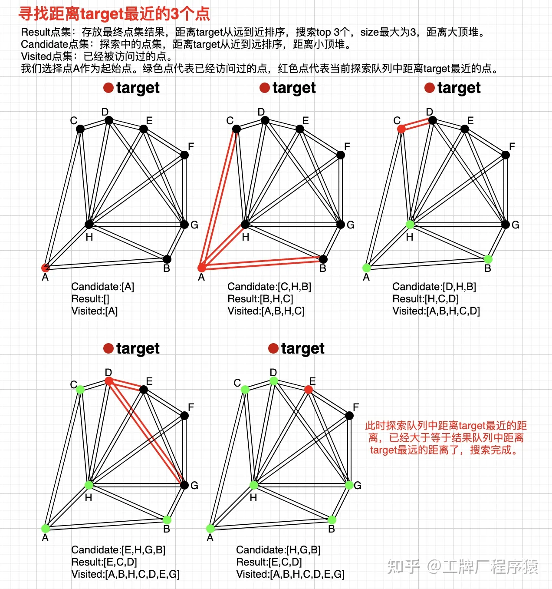
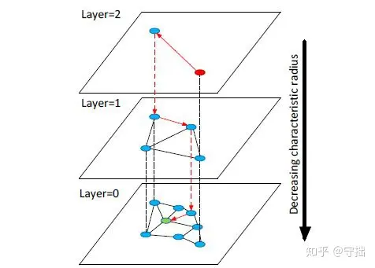
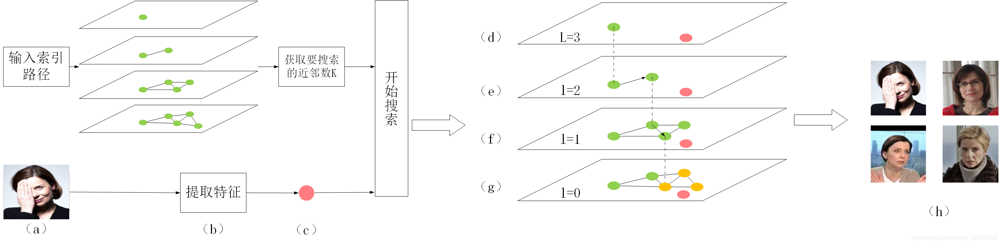
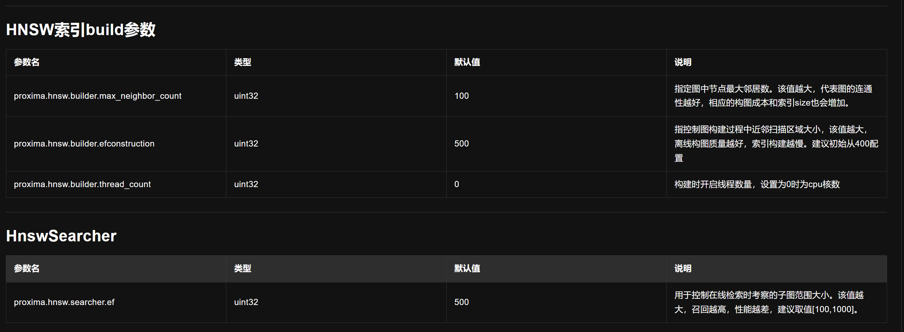

# hnswlib向量索引
## nsw简介
六度分离理论，Stanley Milgram计算信函平均到达的节点为5个，也就是我们和一个陌生人建立连接只需要6步。

Stanley Milgram基于他的实验提出了著名的六度分离理论，这个理论指出:
- 现实世界中的短路径是普遍存在的。
- 人们可以有效地找到并且利用这些短路径。

在小世界网络中，可以把点与点之间的关系可以分为两种：
- 同质性:同质性也就是相似的点会聚集到一起，相互连接具有邻接边。
- 弱连接:弱连接是指从每一个节点上，会有一些随机的边随机连接到网络中的节点上，这些节点是随机均匀的。

<!--  -->
在NSW算法中通过构建一个小世界网络，希望通过黑色相似的近邻边来检索最近邻节点， 通过红色长边(高速公路)来实现不同类节点之间的快速检索。
### nsw图构建
基于NSW的原理，我们希望NSW的局部节点之间的在距离上具有同质性(也就是近邻节点能够相互连接)。从而使得当我们检索 到一个近邻节点时，其大部分近邻节点都是近邻节点。同时也希望保留一些随机边，能够在不同区域之间快速跳转

NSW节点的插入

构建图的时候，理论上来说我们对所有的点做Delaunay三角剖分，然后添加一些随机的长边构建快速检索通道， 就构建了一个可导航的小世界网络。
由于构建Delaunay三角剖分的复杂度太高。实际的代码实现过程中是通过节点随机插入来引入随机性，利用已有节点构建Delaunay边来引入同质性。

NSW的网络构建过程如下:
1. 在候选节点vi里面随机挑选一个节点
2. 将节点vi插入到已经构建好的图中，并构建边。
3. 边构建的规则：找到节点vi最近邻的f个邻居，建立vi和这些邻居的边连接。

### nsw图检索
K 近邻查找

在NSW中K近邻检索的过程如下:
1. 随机选择1个元素，放入到candidates当中
2. 从candidates中选取最近邻节点c，将这些元素的邻居节点放置到q当中
3. 从candidates中移除最近邻节点c
4. 如果c的距离远大于result中的第k个节点，跳出循环
5. 否则，对于c的每个邻居节点，遍历其邻居，如果没有在visited set里面。
6. 将e加入到visited set， candidates， tempRes
7. 遍历完成candidate中所有的节点后，把tempRes的结果传入到result
8. 重复执行上述步骤m遍, 返回result中最优的k个近邻结果。

NSW中，是如何为一个点找到离它最近的M个点的。其实也很简单，我们从图中任意一个点出发，作为起始点，从这个起始点开始，贪心地去接近要查找的点，就好了。搜索过程就是一个greedy search的过程，如图所示。

## hnsw简介
HNSW（Hierarchical Navigable Small Word）算法算是目前推荐领域里面常用的ANN（Approximate Nearest Neighbor）算法了。Hierarchical NSW，分层的nsw方法

<!--  -->

根据上图可以直接看出HNSW在NSW基础上所作的优化。

在HNSW中，引入Layers的概念，总体思想如下:
- 在Layer = 0 层中，包含了连通图中所有的点。
- 随着层数的增加，每一层的点数逐渐减少并且遵循指数衰减定律
- 图节点的最大层数，由随机指数概率衰减函数决定。
- 从某个点所在的最高层往下的所有层中均存在该节点。
- 在对HNSW进行查询的时候，从最高层开始检索。

### hnsw节点插入
节点插入过程

<!--  -->

在整个HNSW的insert的过程中包含以下几个部分。
- 初始化当前最近邻集合W，初始化固定节点ep，获取顶层编号L，获取新插入节点的层l
- 对于属于L->l+1的每一层查找出q的最近邻节点。
- 对于lc <- min(L,l)..0的每一层执行以下步骤:
  - 每一层查找出最近的efConstruction个节点得到集合M。
  - 在每个节点中查找到最近的M个neighbors。(采用算法3,或者算法4)
  - 将在层lc中的所有neighbors和节点q建立连接。
  - 对于neighbors中的每个节点e重新判断一下节点个数，然后减少e节点的邻居节点重新建立连接。

- 如果 l > L，将q设置为hnsw的enter point

一个新的节点，在哪一层开始插入，是随机的。随机是带权的，随机到下层的概率较高。刚才提到，要控制住每个节点的度，论文中的伪代码是给了个度的阈值Max。在每一层进行插入的时候，一旦发现与新插入点Q建立连接的几个邻居节点中，有邻居节点N的连接数超过了Max，则要对N重新进行近邻搜索，并重新与新的几个邻居建立连接

HNSW通过一个随机函数，将所有的点划分到不同层次，越往上节点数越少，边越少。这种情况下节点和节点之间寻找最近邻居的 距离也就越远。因此在从上到小检索的过程中，先通过Long Link找到全局可能的最近节点，然后往下层以该节点为入口 进一步做局部检索。

### hnsw节点查询
在HNSW的查询阶段，包括以下几个算法。

- SEACHER-LAYER: 在指定层查询K个最近邻节点。
- SELECT-NEIGHBORS-SIMPLE: 简单的查找某一层最近的邻居节点。
- SELECT-NEIGHBORS-HEURISTIC: 探索式查找某一层最近的邻居节点。
- K-NN-SEARCH: 从所有候选结果中找出K个最近邻结果。

1. K-NN-SEACHER:

KNN查询的逻辑很简单，从固定的enter节点进入，在顶层开始检索。 在每一层检索到唯一一个最近邻然后作为下一层入口节点。最后在底层检索top K个最相似节点。

检索流程:
其中红色的节点表示搜索节点q(可以是非图中的节点)，绿色节点表示图中已建立的节点，黄色的节点表示搜索结果。
1. 输入索引路径和图片；
1. 根据索引路径加载索引，并对图片提取特征；
1. 获取需要搜索的近邻数K，并将图片特征作为节点输入搜索算法；
1. 在L层找到距离q最近的一个节点ep，并作为下一层的输入；
1. 在l=2层中，从ep开始，在ep的邻居中找到距离q最近的一个邻居，作为新的ep，并作为下一层的输入；
1. 在l=1层中，从ep开始，在ep的邻居中找到距离q最近的一个邻居，作为新的ep，并作为下一层的输入；
1. 在最底层中，从ep开始，搜索距离q最近的K个节点；（h）输出节点q和K个近邻。

### 总结
1. hnsw源码在第0层的邻居的确定，依然通过启发式即"排除近亲"的方式选择，而第0层个人认为已经不需要这样去做，这方面将做一些实验去验证；

2. hnsw索引绝对可以保证高的召回率，相对faiss-ivf系索引，在同等近乎100%召回率结果下，hnsw的耗时几乎是ivf-flat的10倍(平均、p99)，作为ivf-flat的优化，ivfpq及其变种虽然可以减少耗时，但召回率有下降(因为引入了更多的量化)。所以基本上可以说，基于图的比较优秀的算法如hnsw(及一些演进品)，应作为后续我们索引的选择，feed的索引应尽快调整过来。

3. hnsw的索引已经存储了原始向量，且可以获取(经充分调研faiss源码，faiss-ivf系索引，也可以获取原始向量)，当前的相似度debug工具，应尽快去掉"id_emb_mapping"文件的构建上传和加载。

4. 索引分片不应该是hnsw要考虑的问题.根据hnsw的特点，hnsw确实不易于索引分片，而且鉴于其性能也不应该考虑去做分片，那样只能反而更糟。根据大量文章调研，部分大厂针对数十亿量级的数据，可以做到用类似hnsw的算法，8核+64G内存的单机，就能实现很高的查询性能，结合我们当前的数据量，数据量很长一段时间内，不会是我们的瓶颈。

5. hnsw我们可以考虑研发增量热更新.hnsw的增量更新，不论是新增向量还是更新向量，涉及更新许多向量且是多层邻居表，而查询时完全没有加锁行为(所以它是默认无热更新)，这是实现热更新的阻碍。
考虑传统正倒排索引的业界优秀解决方案：如大规模广告系统的索引，在高负载情况下的更新方式其实是：增量构建小索引一同提供查询 + 小索引定容/定时merge合入大索引，这是在大促高流量场景下已验证的成熟方案，hnsw的增量更新面对的问题实际上是一样的，完全可以解决。
### hnsw参数配置

## 参考
HNSW的基本原理及使用 https://zhuanlan.zhihu.com/p/264832755
hnswlib数据结构和源码解读 https://blog.csdn.net/u010246947/article/details/123298675
